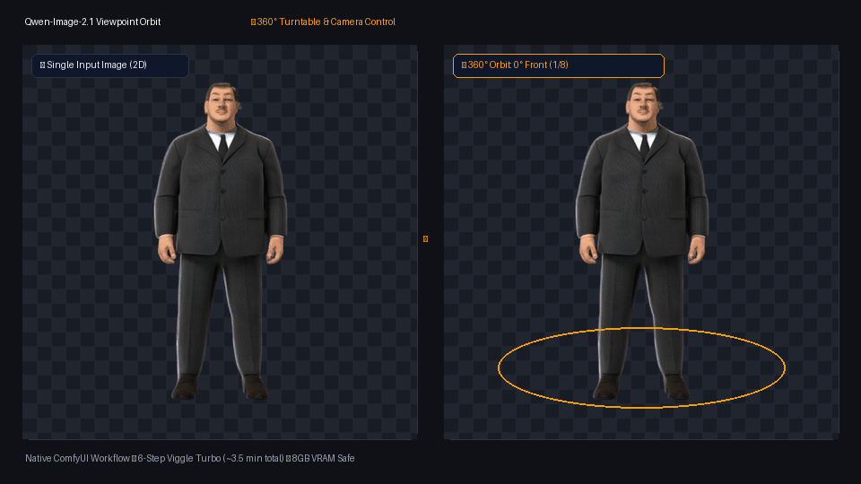
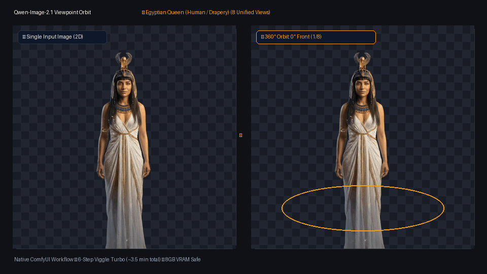
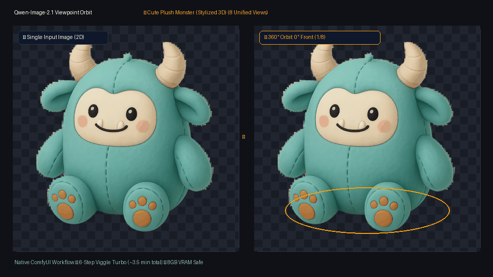
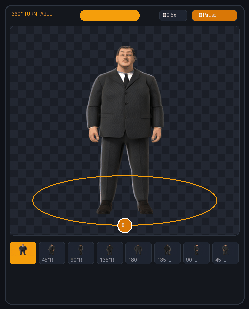

# ComfyUI-Qwen-Image-2.1-Orbit 🌀

[](https://github.com/comfyanonymous/ComfyUI)
[](https://huggingface.co/Qwen/Qwen-Image-2.1)
[](#hardware--vram-optimization)
[](LICENSE)

**Complete 360° Turntable Orbit & Viewpoint Camera Control for Qwen-Image 2.1 in ComfyUI.**

- 🌀 **Full 360° Character Turntables**: Generate 8 seamless, consistent viewpoints from a single 2D image in one click.
- ⚡ **Fix Any Angle in Seconds**: Regenerate and replace just one flawed viewpoint without re-running the entire turntable.
- 🕹️ **Interactive In-Canvas 3D Viewer**: Scrub angles on a 3D orbit ring with live camera tracking and speed controls.
- 📦 **One-Click Multi-Export**: Automatically export looping MP4 video, transparent animated WebP, and individual PNG frames.
- 🛡️ **8GB VRAM Safe**: Runs sequentially under 7 GB VRAM with zero Out-of-Memory crashes on laptop GPUs.

---

## 🎬 Showcase

### 1. Single 2D Image ➔ Complete 360° Viewpoint Orbit
From a single reference image, generate 8 unified viewpoint perspectives with consistent lighting, anatomy, and transparent background across diverse art styles:

#### Example A: Stylized Game Character (Egyptian Mummy)


#### Example B: Realistic Humanoid & Drapery (Egyptian Queen)


#### Example C: 3D Asset / Plush Creature (Cute Monster)


### 2. In-Canvas Interactive 360° Turntable Viewer
Scrub angles directly on the ComfyUI canvas with an elliptical 3D orbit ring and live camera indicator (`📷`), cycle playback speeds (0.5x, 1x, 2x), or save individual frames with one click:



---

## ✨ Key Features

- 🌀 **Full Turntable 360 (8 Unified Views)**:
  - Synthesizes all 8 canonical perspectives in sequence: `0° Front (Generated)` $\to$ `45° Right` $\to$ `90° Right` $\to$ `135° Right` $\to$ `180° Back` $\to$ `135° Left` $\to$ `90° Left` $\to$ `45° Left`.
  - Generates the 0° front view through the model via `<orbit> keep the camera angle, eye level` rather than prepending the raw photo, ensuring **100% unified lighting, consistent style, and zero loop pop**.

- ⚡ **Fix Any Single Angle (`Patch Single Frame`)**:
  - If 7 views are great but one angle (e.g. the 180° back view) needs refinement, select **`Patch Single Frame`**, pick the target angle, and queue.
  - Generates **only that 1 frame** (~4 seconds on Viggle Turbo) and automatically replaces that exact slot in the saved 8-view turntable session without losing the other 7 frames!

- 🎯 **Single View Mode**:
  - Standalone viewpoint generation for a specific camera angle without turntable buffering.

- 🖥️ **Interactive Canvas Viewer (`QwenTurntable360Viewer`)**:
  - Direct HTML5 in-canvas viewer with drag-to-spin scrubbing.
  - Dashed elliptical 3D orbit ring with glowing 📷 camera tracker.
  - Interactive thumbnail ribbon with real-time slot highlighting.
  - Play / Pause and speed presets (`⏱ 0.5x`, `⏱ 1x`, `⏱ 0.25x`, `⏱ 2x`).
  - `💾 Save Frame` button to download the current frame instantly.

- 📦 **Automated Multi-Format Export (`QwenTurntableExport`)**:
  - **H.264 Looping MP4** (`.mp4`) via FFmpeg with selectable background colors (`dark`, `white`, `black`, `gray`) and loop counts.
  - **Animated Transparent WEBP** (`.webp`) with lossless alpha.
  - **Individual PNG Frames** (`.png`) numbered and labeled (`00_front_0deg`, `01_right_45deg`...).

- 🛡️ **Zero Out-of-Memory (8GB VRAM Safe)**:
  - Generates frames sequentially through list execution rather than batching.
  - Peak VRAM stays strictly under **7.0 GB**, completely safe for RTX 4060/4070 (8GB) laptops.

---

## 📦 Included Production Workflows

Both verified workflows are included in the [`workflows/`](workflows/) folder:

| Workflow | Inference Engine | Steps per View | Full 360 Orbit Time | Patch Time | Recommended For |
| :--- | :--- | :--- | :--- | :--- | :--- |
| **`Qwen_Image_2.1_Viggle_Turbo_Viewpoint_Orbit.json`** | **Viggle Turbo LoRA (Distilled)** | **6 steps** | **~3.5 minutes** | **~4 seconds** | ⚡ **Fastest & Recommended** |
| **`Qwen_Image_2.1_Viewpoint_Orbit.json`** | Standard Euler Simple | 28–40 steps | ~12–15 minutes | ~90 seconds | 🎨 High-precision evaluations |

---

## 🚀 Installation

### 1. Clone the Custom Node
Open a terminal in your ComfyUI root directory:

```bash
cd custom_nodes
git clone https://github.com/<your-username>/ComfyUI-Qwen-Image-2.1-Orbit.git
```

### 2. Install Dependencies
```bash
pip install -r ComfyUI-Qwen-Image-2.1-Orbit/requirements.txt
```
*(Only requires standard `torch`, `numpy`, and `Pillow`).*

### 3. Ensure FFmpeg is Available (for MP4 Video Export)
Make sure `ffmpeg` is installed and on your system `PATH` (or placed in `C:\ffmpeg\bin\ffmpeg.exe`).

---

## 📥 Required Models & Checkpoints

Download the following models and place them in their respective ComfyUI directories:

| Model / Component | Recommended File | Destination Folder | Source |
| :--- | :--- | :--- | :--- |
| **Viewpoint Orbit LoRA** | `orbit_alpha_lora.safetensors` (159 MB) | `ComfyUI/models/loras/` | [ML-Intern-lab HF Hub](https://huggingface.co/ML-Intern-lab/Qwen-Image-2.1-viewpoint-orbit-LoRA/blob/main/checkpoints/steps2000res768/orbit_alpha_lora/orbit_alpha_lora.safetensors) |
| **Viggle Turbo LoRA** *(for fast workflow)* | `Qwen-Image-2.1-viggle-turbo-v0.2.1-6step-lora-r128.safetensors` | `ComfyUI/models/loras/` | [Viggle AI HF Hub](https://huggingface.co/viggle-ai) |
| **Text Encoder (W4A8)** | `qwen3vl_8b_w4a8.safetensors` (5.88 GB) | `ComfyUI/models/text_encoders/` | [Comfy-Org HF Hub](https://huggingface.co/Comfy-Org/Qwen-Image-2.1_ComfyUI) |
| **Diffusion Model (DiT)** | `qwen_image_2.1_Q5_K_M.gguf` (or FP8 / BF16) | `ComfyUI/models/unet/` | [city96 GGUF Hub](https://huggingface.co/city96/Qwen-Image-2.1-GGUF) |
| **VAE** | `qwen_image_2.1_vae_bf16.safetensors` | `ComfyUI/models/vae/` | [Comfy-Org HF Hub](https://huggingface.co/Comfy-Org/Qwen-Image-2.1_ComfyUI) |
| **Background Removal** | `RMBG-2.0` | Managed by `comfyui-rmbg` | [comfyui-rmbg](https://github.com/1038lab/ComfyUI-RMBG) |

> ⚠️ **CRITICAL VRAM NOTE FOR 8GB GPUS**:  
> Always use `qwen3vl_8b_w4a8.safetensors` (W4A8 quantization, ~5.88 GB).  
> **Do NOT use `qwen3vl_8b_fp8_scaled.safetensors` (10.58 GB)** on an 8GB GPU, as it will trigger CUDA Out-of-Memory crashes.

---

## 🛠️ How to Use

1. Launch ComfyUI and drag-and-drop [`workflows/Qwen_Image_2.1_Viggle_Turbo_Viewpoint_Orbit.json`](workflows/Qwen_Image_2.1_Viggle_Turbo_Viewpoint_Orbit.json) onto the canvas.
2. In the **Load Image** node, choose any character or object image (the integrated **RMBG-2.0** node will automatically remove the background).
3. In **Qwen Viewpoint Orbit Prompt**:
   - Set `mode` to **`Full Turntable 360`** (generates all 8 unified views).
   - Set `camera_elevation` (e.g. `eye level`, `low angle`, `elevated`).
4. Click **Queue Prompt**.
5. Once complete:
   - Scrub the character in the **Interactive 360° Turntable Viewer**.
   - Check `output/` for the exported MP4, animated WEBP, and individual PNG frames.

### How to Fix / Replace a Single Angle:
1. If angle `180` (back view) or `90 right` needs improvement:
2. In **Qwen Viewpoint Orbit Prompt**, switch `mode` to **`Patch Single Frame`**.
3. Set `camera_angle` to the angle you want to fix (e.g., `180`).
4. Click **Queue Prompt**.
5. Qwen generates *only that single angle* in ~4s. The viewer automatically replaces that exact slot in the 8-frame turntable and re-exports your animated media!

---

## 📐 Camera Angles & Training Instruction Schema

The node implements the 23 verified camera instructions from ML-Intern-lab:

| Move | Elevation | Formatted Instruction |
| :--- | :--- | :--- |
| `keep angle` | `eye level` | `<orbit> keep the camera angle, eye level` |
| `180` | `eye level` | `<orbit> rotate the camera 180 degrees, eye level` |
| `{X} right` | `{elev}` | `<orbit> rotate the camera {X} degrees to the right, {elev}` |
| `{X} left` | `{elev}` | `<orbit> rotate the camera {X} degrees to the left, {elev}` |

Standard suffix appended: `. The image has alpha channel and the background is transparent.`

---

## 💡 Troubleshooting & Tips

- **Backpareidolia (Front face hallucinated on 180° back view)**:  
  For stylized anime/cartoon characters with high-contrast eyes and smile, diffusion models occasionally exhibit frontal bias. If this occurs on a seed, use **`Patch Single Frame`** with `180` and randomize the seed, or add a short subject prefix in `custom_prefix` (e.g., `a stylized 3d mummy character, `).
- **Custom Objects / Pre-Cut Images**:  
  If your input image already has a transparent background, you can bypass the `RMBG` node by selecting it and pressing `Ctrl + B`.

---

## 🤝 Credits & Acknowledgments

- **[ML-Intern-lab](https://huggingface.co/ML-Intern-lab/Qwen-Image-2.1-viewpoint-orbit-LoRA)**: For training the Viewpoint Orbit LoRA and releasing the original Gradio demonstration.
- **[Alibaba Qwen Team](https://github.com/QwenLM/Qwen-Image)**: For the outstanding Qwen-Image 2.1 foundational model and WanVAE.
- **[Viggle AI](https://huggingface.co/viggle-ai)**: For the 6-step Turbo distillation LoRA enabling real-time turntable generation.
- **[ComfyUI](https://github.com/comfyanonymous/ComfyUI)**: For the modular node-based generative AI platform.
- **[BiRefNet / RMBG-2.0](https://github.com/ZhengPeng7/BiRefNet)**: For high-accuracy transparent background segmentation.

---

## 📄 License

This custom node is released under the [MIT License](LICENSE). Models and LoRAs are subject to their respective upstream licenses.
